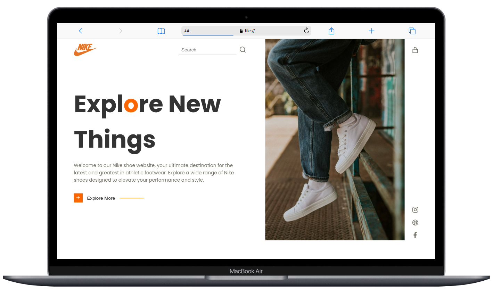

<div align="center">
  
  
  
  
[](https://twitter.com/intent/follow?screen_name=djbonesgh)

  <br />
  <br />

  <h2 align="center">Nikey - Nike Online Store</h2>

Nikey is a fully responsive advanced Nike Store, <br />Responsive for all devices, built using HTML, CSS, and JavaScript.

<a href="https://25dark.github.io/Nikey"><strong>➥ Live Demo</strong></a>

</div>

<br />

### Demo Screenshots



### Prerequisites

Before you begin, ensure you have met the following requirements:

- [Git](https://git-scm.com/downloads "Download Git") must be installed on your operating system.

### Run Locally

To run **Flivan** locally, run this command on your git bash:

Linux and macOS:

```bash
sudo git clone https://github.com/25dark/Nikey.git
```

Windows:

```bash
git clone https://github.com/25dark/Nikey.git
```

### Contact

If you want to contact me you can reach me at [Twitter](https://www.twitter.com/djbonesgh).

### License

This project is **free to use** and does not contain any license.
